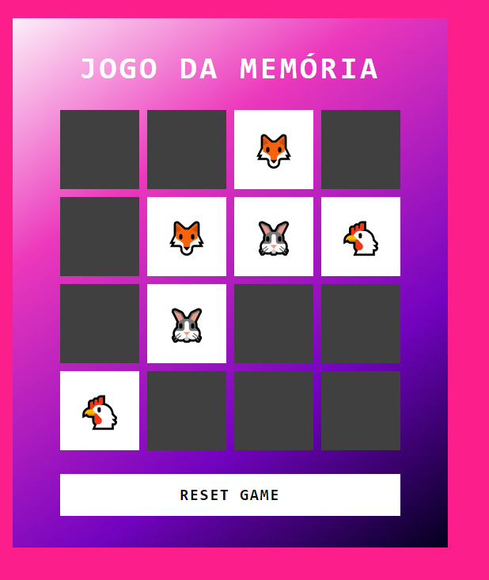

# Jogo da Memória de Emojis

Jogo simples criado em HTML, CSS e JavaScript.

## 📖 Sobre

Um jogo simples onde o jogador deve clicar nos quadrados e encontrar as duplas de emojis.

## 🛠 Recursos utilizados

- HTML e CSS para a estrutura da página e aparência.
- JavaScript para o funcionamento do jogo.
- Emojis

## 🖼 Visão geral

## 📁 Referências

- [DIO Jogo da Memória](https://github.com/digitalinnovationone/js-emoji-memory-game)
